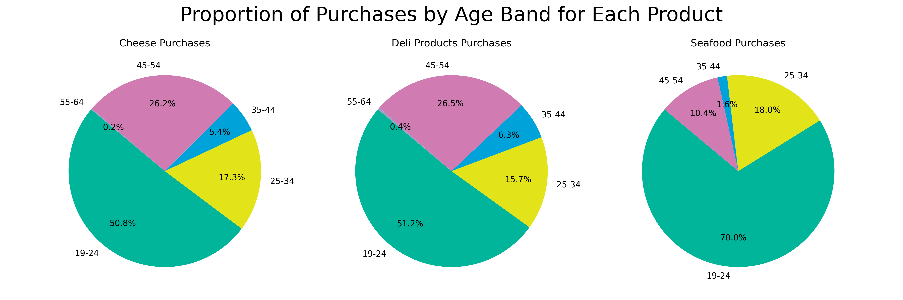

# SuperMax Foods Sales Analysis (2019–2022)
## Project for completion of the RMIT course: Business Analytics with SQL and Python

This project explores a synthetic dataset from a fictional supermarket chain, **SuperMax Foods**, spanning 2019 to 2022. The goal was to derive business insights from transactional sales data and present these findings in a clear, accessible format for a non-technical audience.

---

## Project Overview

The business question presented was: 
SuperFoodsMax decision-makers ask the data team to provide insights that can support a strategy to lift sales revenue by 5% over the next two years. Key personnel you consult suggest focusing on loyal (existing) customers and the conversion of new customers into loyal customers. They reveal that:

- a failure to lift the average spend of loyal customers is stagnating revenue growth
- first-time customers are not converting into regular (loyal) customers.

My analysis focuses on addressing the business strategy to lift sales revenue by 5% over the next two years by answering the following questions:
<ol>
<li>Which products offer the greatest potential for sales growth?
<li>Which customer demographic should we target in our marketing efforts?
<li>How many additional monthly sales are required for each demographic or product to achieve our goal?
</ol>

---

## Repository Structure

data-course-finalproj/
├── data/ # Source CSV file (synthetic sales data provided by RMIT University)
├── notebooks/ # Draft and final analysis notebooks
├── outputs/ # Visualizations generated from the analysis
├── slides/ # Final presentation summarizing insights

---

## Tools Used

- **Python** (Pandas, Matplotlib, Seaborn)
- **Jupyter Notebook**
- **PowerPoint** (for business presentation)
- **Git** (version control)
- **Fedora Linux** (local environment)

---

## Sample Visualisations

---

## Key Takeaways

In order to achieve the stated goal, SuperMax Foods should focus on two marketing campaigns:

- **Top 3 Products**: Seafood, deli products, and cheese are popular and have room to grow. Aim to increase sales by 9 units per product per month.
- **Young Buyers**: Customers aged 19–24 are the top purchasers of focus products. Aim to increase transactions in this demographic by 2–3 per month.

---

## How to Run
<ol>
<li>Install dependencies: 
   `pip install -r requirements.txt`

<li>Clone the repository: 
   [`git clone https://github.com/jendu-builds/data-course-finalproj.git`](https://github.com/jendu-builds/data-course-finalproj.git)

<li>Navigate into the project: 
   `cd data-course-finalproj`

<li>Open the final notebook: 
   `jupyter notebook notebooks/supermax_final.ipynb`
</ol>

---

## Author

Jennifer McIver  
Contact: jen.d.mciver@gmail.com

---

## Notes

- The dataset is synthetic and was provided as part of an educational course. 
- All analysis, interpretation, and visualizations were independently created.
- This project was originally completed as coursework for the RMIT Data Analytics program. The code is shared here solely as a demonstration of personal learning. It should not be reused or submitted elsewhere.

